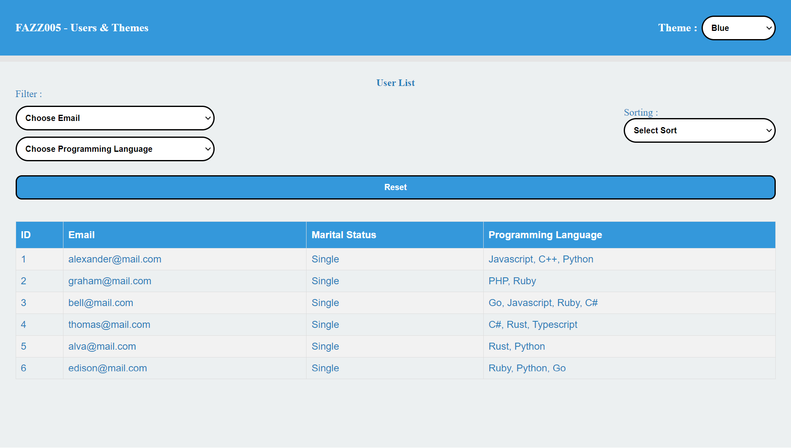

# FAZZ005 SI Users & Theme

## How Run to Local

install Dependencies :

```
npm install
```

run app :

```
npm run dev
```

Open http://localhost:5173

## Screenshot



## Example Deployment

### <https://fazz005-si-users-theme.netlify.app>
